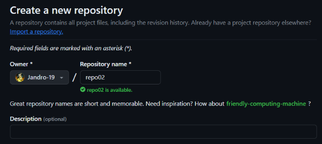

# EJERCICIO 2 ​​​​​🏋️​
## REPOSITORIO REMOTO ​​​​​➡️​ REPOSITORIO LOCAL
### En este ejercicio explicare como hacer un ***commit*** desde un repositorio remoto.
1. Creamos un repositorio remoto en Github llamado ***repo02***.
   
