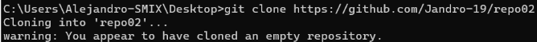
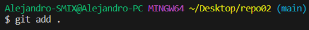
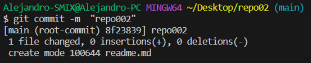

# EJERCICIO 2 ​​​​​🏋️​
## REPOSITORIO REMOTO ​​​​​➡️​ REPOSITORIO LOCAL
### En este ejercicio explicare como hacer un ***commit*** desde un repositorio remoto.
1. Creamos un repositorio remoto en Github llamado ***repo02***.
   
2. Luego de crear el repositorio remoto hay que clonarlo en nuestro dispositivo, en mi caso he entrado al /cmd/ y he puesto el codigo ***git clone "link"*** asi creando un repositorio local con GIT conectado ya al repositorio remoto
   
3. Ahora abrimos el Visual Studio Code para arrastras la carpeta de ***repo02*** y creamos el fichero ***readme.dm***, y escribimos lo que sea, en mi caso he puesto ***## Ejercicio 2***
   
4. Ahora abrimos el terminal para subir la modificación al repositorio remoto, para eso tenemos que hacer un ***git add .*** y despues un ***git commit -m "Primera modificacion"***
    
    

### ! YA TENEMOS NUESTROS REPOSITORIOS CONECTADOS ¡
